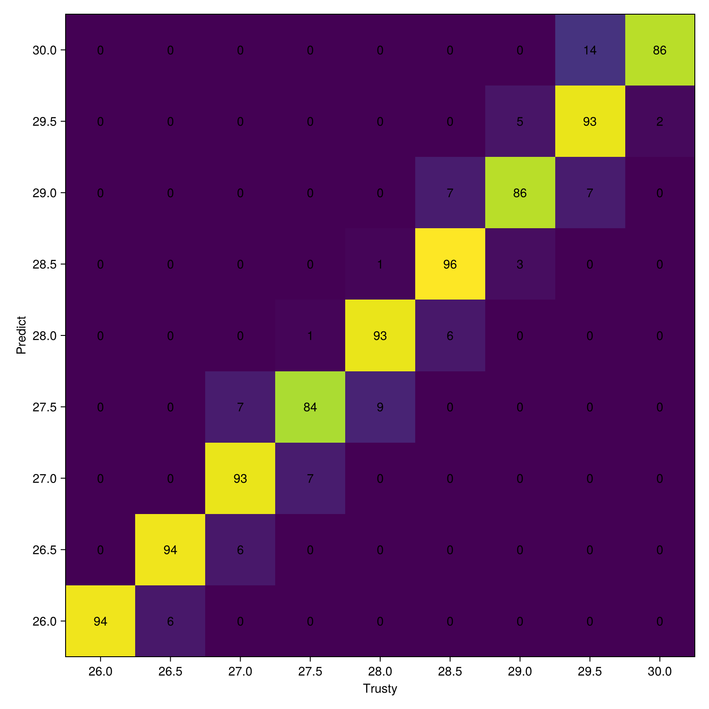

#   Examples

##      Application with `Flux.jl`
[Flux](https://fluxml.ai/Flux.jl/stable/) is a user-friendly machine learning library in Julia that provides a wide range of functionalities. In this example, we demonstrate how to use `Flux.jl` together with `RecurrenceMicrostatesAnalysis.jl` to train a multi-layer perceptron (MLP) to classify a dynamical system, based on [Spezzatto2024](@cite).

### Importing Required Packages
```julia
using Flux
using DifferentialEquations
using RecurrenceMicrostatesAnalysis
```

### Generating Data from the Lorenz System
We use a Lorenz system integrated with `DifferentialEquations.jl` as our data source:
```julia
function lorenz(σ, ρ, β; u0 = rand(3), tspan = (0.0, 5000.0))
    function lorenz!(du, u, p, dt)
        x, y, z = u
        
        du[1] = σ * (y - x)
        du[2] = x * (ρ - z) - y
        du[3] = x * y - β * z
    end

    prob = ODEProblem(lorenz!, u0, tspan)
    sol = solve(prob, dt = 0.00001)

   ##   Apply the vicinity (important!)
   return prepare(sol, 0.2; transient = 40000, K = 500)
end
```

### Experiment Settings
```julia
ρ_cls = [26.0, 26.5, 27.0, 27.5, 28.0, 28.5, 29.0, 29.5, 30.0]      # Our classes
num_samples_to_test = 100           # Samples to test
num_samples_to_train = 400          # Samples to train

epoches = 80            # Epoches to train
learning_rate = 0.002   # Learning rate

motif_n = 3             # Motif size
```

### Defining the Model
```
model = Chain(
    Dense(2^(motif_n * motif_n) + 2 => 512, identity),
    Dense(512 => 256, selu),
    Dense(256 => 64, selu),
    Dense(64 => length(ρ_cls)),
    softmax
)

model = f64(model)      # We use Float64 precision 😄
```

### Preparing the Dataset
Our input features include the threshold, recurrence entropy, and recurrence distribution:

```julia
data_train = zeros(Float64, 2^(motif_n * motif_n) + 2, num_samples_to_train, length(ρ_cls))
data_test = zeros(Float64, 2^(motif_n * motif_n) + 2, num_samples_to_test, length(ρ_cls))

labels_train = zeros(Float64, num_samples_to_train, length(ρ_cls))
labels_test = zeros(Float64, num_samples_to_test, length(ρ_cls))

for j in eachindex(ρ_cls)

    labels_train[:, j] .= ρ_cls[j]
    labels_test[:, j] .= ρ_cls[j]

    for i in 1:num_samples_to_train
        serie = lorenz(10.0, ρ_cls[j], 8.0/3.0)
        th, s = find_parameters(serie, motif_n)
        data_train[1, i, j] = th
        data_train[end, i, j] = s

        data_train[2:end-1, i, j] .= distribution(serie, th, motif_n)
    end

    for i in 1:num_samples_to_test
        serie = lorenz(10.0, ρ_cls[j], 8.0/3.0)
        th, s = find_parameters(serie, motif_n)
        data_test[1, i, j] = th
        data_test[end, i, j] = s

        data_test[2:end-1, i, j] .= distribution(serie, th, motif_n)
    end
end

##  Reshape to match the expected input format for Flux.
data_train = reshape(data_train, 2^(motif_n * motif_n) + 2, num_samples_to_train *  length(ρ_cls))
data_test = reshape(data_test, 2^(motif_n * motif_n) + 2, num_samples_to_test * length(ρ_cls))

labels_train = reshape(labels_train, num_samples_to_train * length(ρ_cls))
labels_test = reshape(labels_test, num_samples_to_test * length(ρ_cls))
```

### Training the MLP
```julia
labels_train = Flux.onehotbatch(labels_train, ρ_cls)
labels_test = Flux.onehotbatch(labels_test, ρ_cls)

loader = Flux.DataLoader((data_train, labels_train), batchsize = 32, shuffle = true)
opt = Flux.setup(Flux.Adam(learning_rate), model)

for epc in 1:epoches
    for (x, y) in loader
        _, grads = Flux.withgradient(model) do m
            y_hat = m(x)
            Flux.crossentropy(y_hat, y)
        end

        Flux.update!(opt, model, grads[1])
    end
end
```

### Evaluation
We evaluate the trained model using a confusion matrix and obtain an accuracy of 86.1%:
