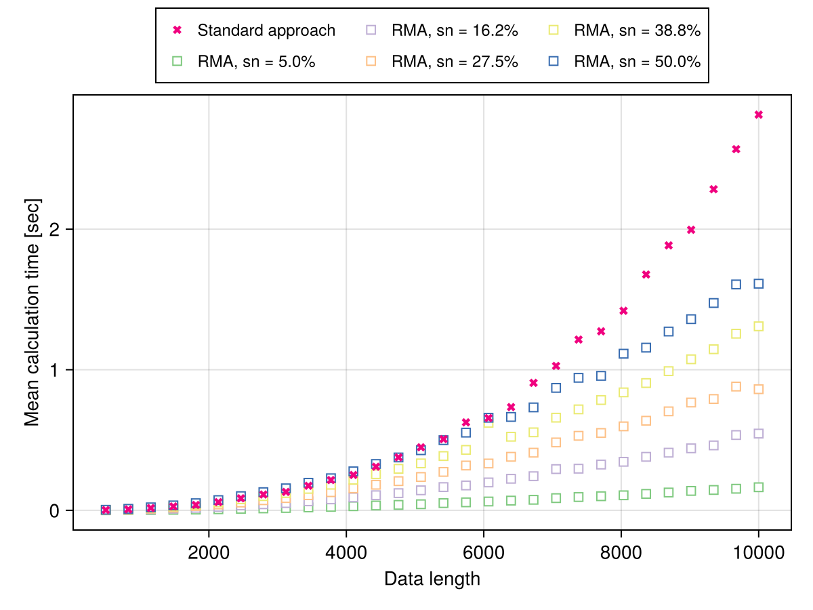
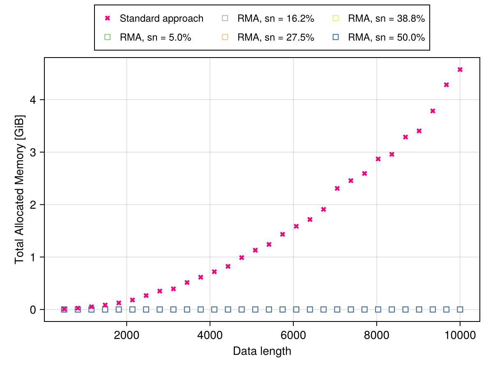

# Performance tips to use `RecurrenceMicrostatesAnalysis.jl`
One of the main goals of `RecurrenceMicrostatesAnalysis.jl` is its computational performance, being fast and light. For it, `RecurrenceMicrostatesAnalysis.jl` has a good memory managment, allocating only the necessary memory, and a good adaptability to multi-threading jobs, spliting the work between all available threads. For that, we recommend to always use `threads = true` with the `distribution` function, and define a number of threads different than one in the enverionment variable `JULIA_NUM_THREADS`, or openning julia using `julia --threads 8`.

It is crucial to note that how much larger is a dataset, more time is needed to the library compute a recurrence motif distribution, and the number of samples can also affect it.


With respect of memory consumition, `RecurrenceMicrostatesAnalysis.jl` has even better performance, being extremally light. The library allocates only the necessary memory to store information, such as a vector with the number of each motif that there is in some recurrence space. It is possible to see in the following graphic the library memory usage when compared with standard approach. 


`RecurrenceMicrostatesAnalysis.jl` allocates memory for each thread, so when you increase the number of available threads, the library will allocate more memory to avoid concurrency. It is also necessary to allocate more memory when we increase the motif size `n`, that is based on the motif area $\sigma$ (our hypervolume for spatial generalization), so largest motifs needs more memory per thread.

These measures were made using the library `BenchmarkTools.jl`.
```@repl performance
using Distributions, RecurrenceMicrostatesAnalysis, BenchmarkTools
data = rand(Uniform(0, 1), 10000);
@benchmark distribution(data, 0.27, 3)
@benchmark distribution(data, 0.27, 3; sampling_mode = :full)
@benchmark distribution(data, 0.27, 4)
@benchmark distribution(data, 0.27, 4; sampling_mode = :full)
```