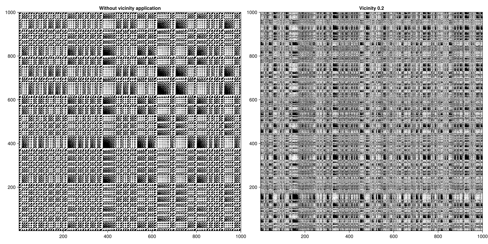

# Utilitary functions

`RecurrenceMicrostatesAnalysis.jl` has several utilitary functions to help when using the library. These functions allows to simplify the process to implement recurrence analysis to a project, facilitating the set of a threshold, or the preparation of continuous data to be analysed.

!!! warning
    Some function presented in this section was still in development, so these function can change in future versions.

## Preparing a continuous data
When working with continuous data, it is important to do a discretization, changing the time resolution to improve the available information. `prepare` is an utilitary function to discretize the data, applying a vicinity parameter to change the data time resolution [Thiago2024](@cite).
```@repl utils
function lorenz!(du, u, p, t)
    du[1] = 10.0 * (u[2] - u[1])
    du[2] = u[1] * (28.0 - u[3]) - u[2]
    du[3] = u[1] * u[2] - (8 / 3) * u[3]
end

using DifferentialEquations, RecurrenceMicrostatesAnalysis
u0 = [1.0; 0.0; 0.0];
tspan = (0.0, 1000.0);
prob = ODEProblem(lorenz!, u0, tspan);
sol = solve(prob);

data_prepared = prepare(sol, 0.2)
```

!!! info    
    It is possible to see the difference between the data solution and the prepareted data when we make a RP.
    

The `prepare` function can also apply a transient phase to the data, using the **kword** `transient`, and define the data length, using the **kword** `K`.
```@repl utils
data_prepared = prepare(sol, 0.2; transient = 6000, K = 1000)
```

##  Finding threshold

The threshold is a free parameter that need to be defined by the user when working with RP, RQA, or RMA. Using the principle of maximizing the recurrence entropy, we build a function to estimate a good value for threshold [Thiago2024](@cite). The `find_parameters` function returns a `Float64` value to be used as threshold and the maximazed entropy. It is important to note that this function can be a little slower, since it needs to compute a recurrence motif distributions for each threshold in some interval.

```@repl utils
th, s = find_parameters(data_prepared, 3)
```